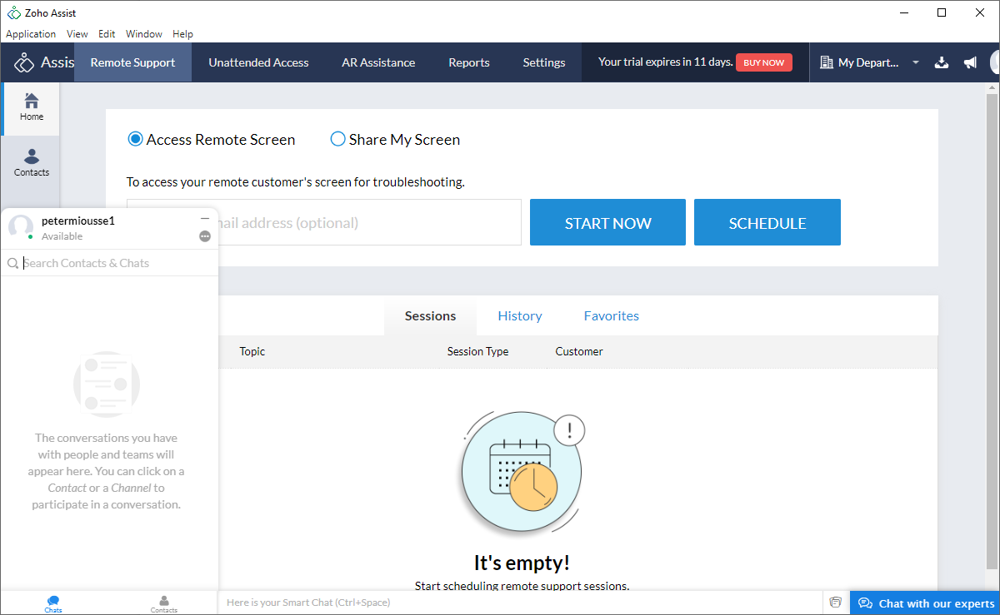

<h1>Guide d'utilisation de Zoha Assist</h1>

<h2>Première étape</h3>

Suivez la formation d'installation de Zoha Assist.

<h3>Support en temps réel ou partage d'écran</h3>

Choisissez l'option "Acces Remote Screen" pour contrôler l'ordinateur d'un client ou utiliser "Share My Screen" pour partager votre écran. Pesez sur l'option "START NOW" pour commencer une session d'aide à distance. À mentionner que vous pouvez rajouter l'adresse électronique de votre client pour lui envoyer directement l'invitation.

La nouvelle fenêtre ouverte vous donnera plus d’option pour vous connecter sur l'ordinateur de votre client.
Vous pouvez lui envoyez le code marquer sur votre écran, un que vous pouvez copier  à partir de la nouvelle fenêtre,
un message vers son adresse électronique directement ou un message par SMS.

Vous pouvez utiliser "SCHEDULE" pour programmer une séance d'aide à distance avec votre client.
Vous pouvez ajouter une adresse électronique de destination, un titre, une description et choisir toutes informations par rapport moment de la session à venir. Vous allez pouvoir voir les sessions programmées dans l'accueil de l'application ou dans la section "SERVICE QUEUE".

Dans la partie "Remote Support" vous pouvez voir les sessions faites par le passé, les sessions programmées et vos sessions préférées.
Vous avez les mêmes options dans la partie "AR Assistance" dans la bande du haut.

<h3>Contacts</h3>

Dans la section "Contacts" vous pouvez ajouter un contacte en cliquant sur "ADD CONTACT", puis en renseignant les informations d'un de vos clients. Il suffit ensuite de cliquer sur "SUBMIT". 

À noter que vous pouvez importer des profils de clients en cliquant sur "IMPORT CONTACT" et puis en choisissant votre option d'importation entre une importation à partir de Google, une importation à partir de votre compte Zoho CRM (si vous en avez un) et une importation à partir d'un fichier à cet effet.

<h3>Contrôle à distance sur le long terme</h3>

Dans la partie "Unattended Access" du logiciel vous pouvez activé un contrôle à distance qui peut durer dans le temps et ne pas a avoir besoin de votre client tout le temps pour l'activé. Il y a trois options à votre disposition : utilisation d'un lien, déploiement pour un réseau et l'installation d'un système d'exploitation à cet effet.

<h3>Informations avancées sur les sessions</h3>

La section "Reports" vous permet d'avoir plus d'informations sur les différentes sessions d'aide à distance déjà faites qu'elles soient avec le client connecté ou non avec vous pendant la session. Il y a le nombre de sessions, la durée des sessions, le nombre de sessions par technicien, la durée des sessions par technicien, les sessions demandées par des clients et la partie "Live Reports" pour avoir des informations sur l'ensemble des sessions. 

Vous pouvez ajusté la période sur laquelle voulez voir les informations sur les différentes sessions déjà faites.

<h3>Messages</h3>

Dans l'application il y a des boutons qui reste tout le temps en bas à gauche de l'écran: "Chats" et "Contacts". Les deux onglets permettent d'avoir vos différentes conversations avec d'autres personnes par texte et de rechercher vos contacts avec une personne dans vos contacts.

Vous pouvez contacter les experts de Zoho Assist en cliquant sur le bouton à cet effet en bas droit de l'interface. Vous mettez votre courriel si ce n'est pas déjà fait et vous écrivez votre message. Ensuite, vous cliquer sur le bouton pour envoyer le message.

Avec le bouton "Contact Us" en bas à gauche de l'interface, vous pouvez contacter les personnes de Zoho Assist et poser des questions par rapport à un ou des problèmes que vous rencontrez. Il y a aussi des informations qui peuvent être utiles pour les contacter autrement.

<h3>Zoho Notebook</h3>

En bas à droite du logiciel, il y a un bloc-notes, "Zoho NoteBook", qui est disponible. 

Le carré avec le symbole plus à l'intérieur permet de créer des notes avec plusieurs options: un texte, une liste de choses à faire, une photo et joindre un fichier. La loupe permet de faire des recherches dans les notes déjà existantes. Si vous cliquez directement sur une note, vous pourrez la modifier: changer son arrière-plan, changer son titre, changer son texte, supprimer la note, l'ouvrir sur internet ou sortir de celle-ci avec le X.

